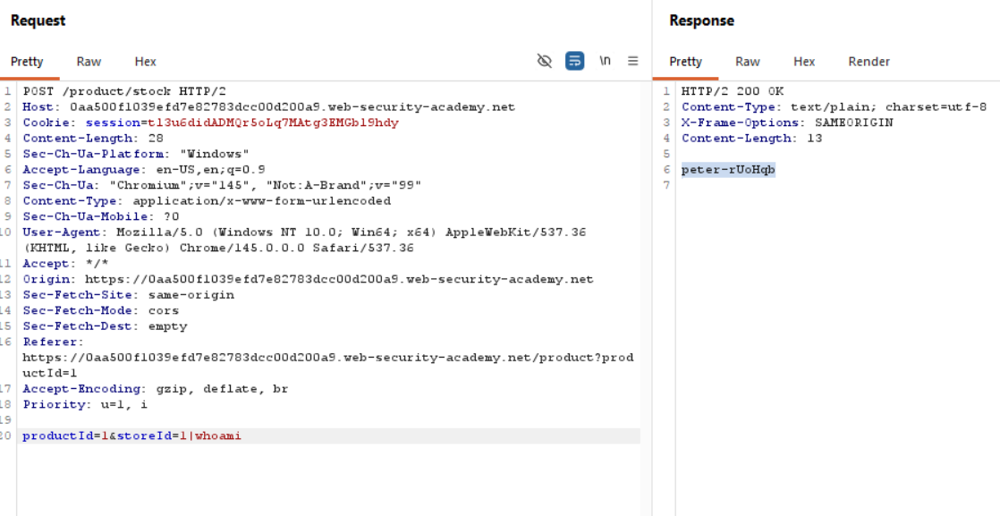

# 💻 OS Command Injection (Product Stock Checker)

## 🔍 Overview

This lab contains an OS command injection vulnerability in the product stock checker feature.

The application builds a shell command using user-controlled inputs (`productId` and `storeId`) and returns raw command output in the HTTP response.

## 💣 Attack Idea

If user input is concatenated into a shell command without proper sanitization, an attacker can inject command separators (such as `;`, `&&`, or `|`) and run additional system commands.

## 🧪 Example Payloads

```text
1|whoami
1;whoami
1&&whoami
```

## ⚙️ Exploitation Steps (Generalized)

1. Open a product page and trigger the stock checker.
2. Intercept the request in Burp Suite.
3. Send the request to Repeater.
4. Inject a payload into `storeId` (or another injectable parameter), for example:

```http
storeId=1|whoami
```

5. Send the modified request.
6. Read the command output from the response body.

## ✅ Lab Result

The injected `whoami` command reveals the operating system user used by the application process.

```text
peter-rUoHqb
```

## 💥 Impact

- Arbitrary command execution on the server
- Data disclosure from local system files
- Lateral movement and deeper server compromise

## 🛡️ Prevention

- Avoid shell command construction with user input
- Use safe APIs without shell interpretation
- Enforce strict allow-lists for expected parameter formats
- Apply server-side input validation and output encoding
- Run services with least privilege and isolation

## 🔐 Prevention Example (Using This Request Pattern)

### Vulnerable Request (Lab Pattern)

When the backend directly uses request values in a shell command, input like `storeId=1|whoami` can trigger command injection.

```http
POST /product/stock HTTP/2
Host: <lab-host>
Content-Type: application/x-www-form-urlencoded

productId=1&storeId=1|whoami
```

### Secure Approach

1. Validate `productId` and `storeId` as strict numeric values.
2. Do not pass user input to a shell.
3. Use argument-based process execution (`shell=False`) or direct database/service queries.

```python
# Safe example: no shell interpretation, strict validation
from subprocess import run

def check_stock(product_id: str, store_id: str):
	if not (product_id.isdigit() and store_id.isdigit()):
		raise ValueError("Invalid input")

	# Pass arguments as a list and keep shell=False
	result = run(
		["/usr/local/bin/stock-checker", "--product", product_id, "--store", store_id],
		capture_output=True,
		text=True,
		shell=False,
		check=True,
	)
	return result.stdout
```

Even if an attacker sends `storeId=1|whoami`, validation blocks it because only digits are allowed.

    

Add your lab screenshot here:

```md

```

## ⚠️ Disclaimer

This write-up is for educational purposes only.
All testing should be performed in legal, authorized lab environments.
